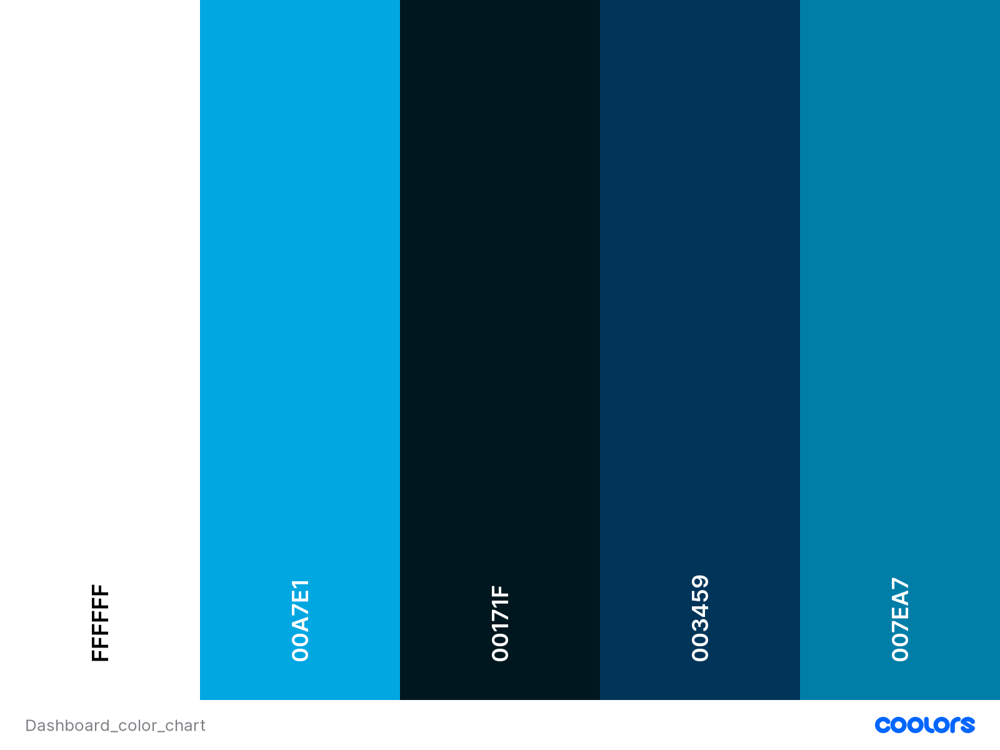

# **Dashboard - Technical Documentation**

## **Frontend**

### **Techonolgy**

The Frontend is made in JS with the framework ReactJS (17.0.2).

See [documentation](https://fr.reactjs.org/docs/getting-started.html)

### **Packages**

- Material-ui (5.1.0): [documentation](https://mui.com/)
- moment (2.29.1): [documentaion](https://momentjs.com/docs/)
- react-dragable (4.4.4): [documentation](https://www.npmjs.com/package/react-draggable)
- react-router (6.0.2): [documentation](https://reactrouter.com/)

### **Design***

#### **Colors**

____

## **Backend**

### **Technology**

The backend API server is made in JS with the framework ExpressJS (4.17.1)

See [documentation](https://expressjs.com/fr/)

### **Packages**

- moment (2.29.1): [documentaion](https://momentjs.com/docs/)
- axios (0.24.0): [documentation](https://axios-http.com/docs/intro)
- bcryptjs (2.4.3): [documentation](https://openbase.com/js/bcryptjs/documentation)
- body-parser (1.19.0): [documentation](https://openbase.com/js/bcryptjs/documentation)
- cookie-parser (1.4.5): [documentation](https://www.npmjs.com/package/cookie-parser)
- cookie-session (1.4.0) [documentation](https://www.npmjs.com/package/cookie-session)
- express-session (1.17.2) [documentation](https://www.npmjs.com/package/express-session)
- mongoose (6.0.12) [documentation](https://mongoosejs.com/docs/)
- passport (0.5.0) [documentation](http://www.passportjs.org/docs/)

____

## **Database**

### **Technology**

To store users & widgets MongoDB is used (v5).

[Learn more](https://www.mongodb.com/cloud/atlas/lp/try2?utm_content=rlsavisitor&utm_source=google&utm_campaign=gs_emea_rlsamulti_search_core_brand_atlas_desktop_rlsa&utm_term=mongo%20db&utm_medium=cpc_paid_search&utm_ad=e&utm_ad_campaign_id=14412646455&adgroup=131761126492&gclid=Cj0KCQiA47GNBhDrARIsAKfZ2rAB647R-SJrEefesCMnnlwuiisVYlOG5DWAD4eF5wqNHUpE4ZyXjgQaAksFEALw_wcB)

____

## **Deployment**

### ***Technology**

All deployment is handle by `Docker`.

### **Architecture**

The client, server and database are in separated containers.

Containers are handler by the `docker-compose` at the root of the project.

#### **Volumes**

The data on the database are permanent and stored into a volume.